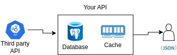

# Python Backend Developer Test

In this test the candidate is expected to be able to develop an API using Python as programming language, communicate with a database and use cache to increase the performance of this application. Also, be able to consume a third party API using standard authentication methods. And finally, to automatically generate the respective documentation following the [OpenAPI](https://www.openapis.org/) standard specification.

## Description

Develop an API in which you can query the value of the current Bitcoin (or any other cryptocurrency) and store this result in a local database and at the same time in cache for later use. Also, this endpoint must be able to convert from the price of the selected currency(ies) to another, this result will not be cached.

## Assessment

1. It must include an endpoint that allows to obtain the metadata of a cryptocurrency at the moment of making the request, and that optionally converts them to any other currency; that includes the following parameters:
   
   - | name      | type     | description                                                                                                                                                          | required |
     | --------- | -------- | -------------------------------------------------------------------------------------------------------------------------------------------------------------------- | -------- |
     | `symbol`  | `string` | Alternatively pass one or more comma-separated cryptocurrency symbols. Example: "BTC,ETH".                                                                           | `True`   |
     | `convert` | `string` | Optionally calculate market quotes for the given currencies at once by passing a comma-separated list of cryptocurrency or fiat currency symbols. Example: "USD,NIO" | `False`  |

2. It should generate OpenAPI documentation automatically and expose an endpoint for viewing.

3. You should write unit tests that cover as many cases as possible.

## Rules

1. If your API does not have the information of a cryptocurrency, it must:
   
   1. Query third party API ([CoinMarketCap](https://coinmarketcap.com/api/)).
   
   2. Save the result in a local database.
   
   3. Cache the result (with an expiration of 60 seconds).
   
   4. Return the result.

2. If your API already has the information, it should:
   
   1. Query the cache first and return that value, if found.
   
   2. Otherwise, query the database and return that value, if found. *At this step, the result must be cached again for another 60 seconds.*
   
   3. Otherwise, perform the steps from rule #1.

## Suggested resources

- [Python](https://www.python.org/).

- [Django](https://www.djangoproject.com/).

- [Django REST framework](https://www.django-rest-framework.org/).

- [drf-spectacular](https://drf-spectacular.readthedocs.io/en/latest/), for automatic OpenAPI schema generation.

- [PostgreSQL](https://www.postgresql.org/).

- [Redis](https://redis.io/) or [memcache](https://memcached.org/), for in-memory cache.

- [Docker](https://www.docker.com/).

- [CoinMarketCap](https://coinmarketcap.com/api).
